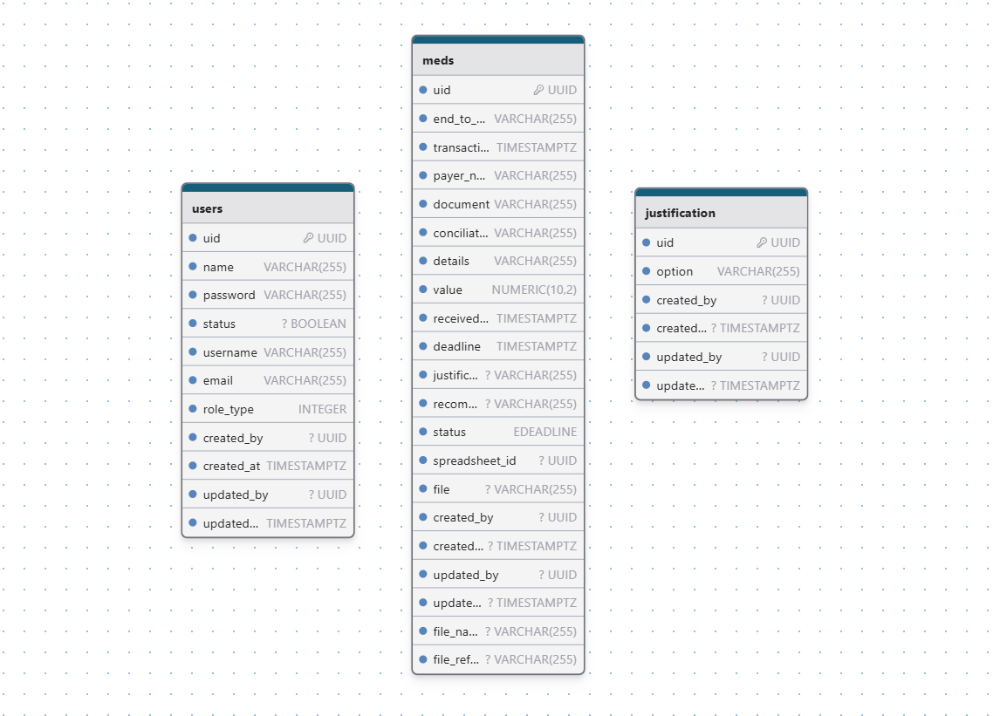

# Sistema de Backoffice de MED

WARNING: **Status da aplicação**
**Em produção**

---

#### Contexto

A aplicação de Backoffice de MED é uma aplicação de uso interno da Bankizi que visa automatizar a gestão de MED (Mecanismo Especial de Devolução). MED é uma ferramenta do Banco Central que permite a devolução de valores transferidos via Pix em casos de fraudes, golpes ou erros operacionais.
A banco provedor envia para a Bankizi uma planilha contendo todas as solicitações de MED geradas a partir da operação de iGaming para que a Bankizi possa tomar as atitudes cabíveis para cada caso, essa planilha deve ser analisada, processada, adicionada com informações e devolvida para o banco provedor em no máximo 4 dias corridos após o recebimento.

---

#### Aplicações

O sistema é composto de duas aplicações: um dashboard no front-end responsável por apresentar as informações de MED aos administradores e responsável de compliance e um back-end responsável por salvar informações no banco de dados e servir o dashboard com as informações necessárias.
As aplicações estão divididas em repositórios separados e independentes.

---


#### Dashboard Front-end

##### Tecnologias utilizadas

- Framework FUSE React
- React
- TailwindCss
- MaterialUI (MUI)
- Typescript

#### Back-end

##### Tecnologias utilizadas

- Serverless Framework
- AWS Lambdas
- Typescript
- NodeJS
- JWT
- PostgreSQL
- KnexJS

---

#### Banco de dados

- É um banco de dados PostgreSQL.


##### Modelagem do banco de dados



---

#### Estrutura/Organização do projeto da API

O código-fonte do projeto se encontra principalmente dentro do diretório `src`. Esse diretório é dividido em:

- `functions` - contém o código-fonte e as configurações das lambdas
- `libs` - contém código/funções compartilhadas entre as lambdas
- `utils` - contém algumas funções auxiliares

```
.
├── src
│   ├── @types                  # Knex global types module
│   ├── config
│   │     └── db                # Knex configuration file
│   ├── functions               # Lambda configuration and source code folder
│   │   └── auth
│   │       └── dto
│   │           └── auth.dto.ts # `Auth` DTO and schema definitions
│   │       ├── handler.ts      # `Auth` lambda source code
│   │       ├── index.ts        # `Auth` lambda Serverless configuration
│   │       ├── routes.ts       # `Auth` routes definitions
│   │       ├── user.controller # `Auth` controller responsible by receive requests 
│   │       └── user.service.ts # `Auth` service is where the business logic and DB comunication is wrapped
│   │   └── meds
│   │       └── dto
│   │           └── auth.dto.ts # `Meds` DTO and schema definitions
│   │       ├── handler.ts      # `Meds` lambda source code
│   │       ├── index.ts        # `Meds` lambda Serverless configuration
│   │       ├── routes.ts       # `Meds` routes definitions
│   │       ├── user.controller # `Meds` controller responsible by receive requests 
│   │       └── user.service.ts # `Meds` service is where the business logic and DB comunication is wrapped
│   │   └── users
│   │       └── dto
│   │           └── auth.dto.ts # `Users` DTO and schema definitions
│   │       ├── handler.ts      # `Users` lambda source code
│   │       ├── index.ts        # `Users` lambda Serverless configuration
│   │       ├── routes.ts       # `Users` routes definitions
│   │       ├── user.controller # `Users` controller responsible by receive requests 
│   │       └── user.service.ts # `Users` service is where the business logic and DB comunication is wrapped
│   │
│   ├── libs                                        # Lambda shared code
│   │    └── api-gateway.ts                         # API Gateway specific helpers
│   │    └── app.error.ts                           # Custom error handlert
│   │    └── aws.service.ts                         # Handles file uploads to AWS S3
│   │    └── check-user-by-document-and-email.ts    # Verifies if a user exists
│   │    └── handler-resolver.ts                    # Sharable library for resolving lambda handlers
│   │    └── hash.ts                                # Generates a hashed string
│   │    └── helpers.ts                             # Formats API Gateway responses
│   │    └── zod-validator.ts                       # Validates request bodies using Zod
│   │
│   │
│   ├── middlewares             # Middlewares like auth middleware
│   └── utils                   # Some utils resources, functions, extension methods, etc
├── package.json
├── serverless.ts               # Serverless service file
├── tsconfig.json               # Typescript compiler configuration
└── tsconfig.paths.json         # Typescript paths
```

---

#### Autenticação/Segurança

- A aplicação utiliza JWT token para realizar a autenticação e autorização de acesso ao sistema. Após realizar o login no sistema a API retorna um `access_token`. Esse token é enviado através do request headers (Authorization) em todas as requisições para a API.

- Existe um middleware de autenticação na API que valida este token em toda requisição que tenta acessar um endpoint privado.

#### Lambdas

##### authLambda

- Responsável por realizar o fluxo de login/signin e manter o usuário logado através do JWT token.
- Login/signin pode ser realizado através de email/username e senha.

##### medsLambda

- Responsável por fornecer as informações de MED que populam a tela de listagem de transações MED na seção principal e na seção de compliance (evidência), detalhes de uma transação MED, realizar upload de planilha alimentando a listagem, gerar planilha através da data de recebimento, realizar upload de evidências, efetuar análise de uma transação MED e trazer lista de justificativas possíveis na análise de um MED.
- Todas as rotas desta lambda são privadas/autenticadas através de JWT.
- A listagem de transações MED podem ser filtradas por **ID EndToEnd**, **Status** e **Data Referência Planilha**. Há um checkbox para mostrar registros com prazos vencidos, por padrão a listagem desconsidera registros com data de prazo anteriores à data atual.

- Ao gerar uma planilha através da data de recebimento, o formato de data enviado deve ser `YYYY-MM-DD`.

- Ao analisar um MED, o campo `recommendation` só aceita as opções `ACCEPT` ou `REJECT`.

- Ao realizar upload de uma planilha, o arquivo deve estar no padrão de nome: `Anexo_IZIPAY NOW_DDMMYYYY` e com as colunas no padrão a seguir:
    - ID EndToEnd
    - Data Transação
    - Nome Pagador
    - CPF/CNPJ
    - ID de Conciliação
    - Detalhes
    - Valor PIX

##### userLambda

- Responsável pelo CRUD de usuários do sistema (Gestão de usuários)
- É uma rota privada/autenticada através de JWT.
- Apenas usuários do tipo Admin possuem permissão para realizar ações de gestão de usuários.

Ao criar um novo usuário ele pode ter dois perfis:

- roleType = 1 (admin)
- roleType = 2 (compliance)