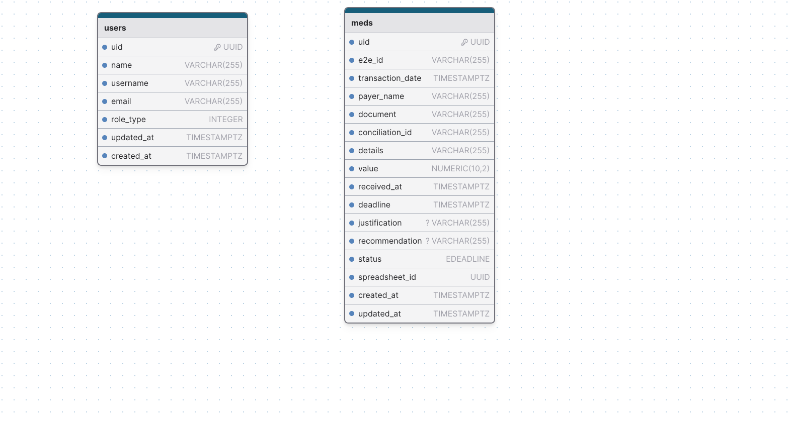

# Sistema de Backoffice de MEDs

WARNING: **Status da aplicação**
**Em desenvolvimento**

---

#### Contexto

A aplicação de Backoffice de MED's é uma aplicação de uso interno da Bankizi que visa automatizar a gestão de MED's (Mecanismo Especial de Devolução). MED é uma ferramenta do Banco Central que permite a devolução de valores transferidos via Pix em casos de fraudes, golpes ou erros operacionais.
A banco provedor envia para a Bankizi uma planilha contendo todas as solicitações de MEDs geradas a partir da operação de iGaming para que a Bankizi possa tomar as atitudes cabíveis para cada caso, essa planilha deve ser analisada, processada, adicionada com informações e devolvida para o banco provedor em no máximo 4 dias corridos após o recebimento.

---

#### Aplicações

O sistema é composto de duas aplicações: um dashboard no front-end responsável por apresentar as informações de MED's aos administradores e responsável de compliance e um back-end responsável por salvar informações no banco de dados e servir o dashboard com as informações necessárias.
As aplicações estão divididas em repositórios separados e independentes.

---


#### Dashboard Front-end

##### Tecnologias utilizadas

- Framework FUSE React
- React
- TailwindCss
- MaterialUI (MUI)
- Typescript

#### Back-end

##### Tecnologias utilizadas

- Serverless Framework
- AWS Lambdas
- Typescript
- NodeJS
- JWT
- PostgreSQL
- KnexJS

---

#### Banco de dados

- É um banco de dados PostgreSQL.


##### Modelagem do banco de dados



---

#### Estrutura/Organização do projeto da API

O código-fonte do projeto se encontra principalmente dentro do diretório `src`. Esse diretório é dividido em:

- `functions` - contém o código-fonte e as configurações das lambdas
- `libs` - contém código/funções compartilhadas entre as lambdas
- `utils` - contém algumas funções auxiliares

```
.
├── src
│   ├── @types                  # Knex global types module
│   ├── config
│   │     └── db                # Knex configuration file
│   ├── functions               # Lambda configuration and source code folder
│   │   └── users
│   │       ├── handler.ts      # `Users` lambda source code
│   │       ├── index.ts        # `Users` lambda Serverless configuration
│   │       ├── routes.ts       # `Users` routes definitions
│   │       ├── user.controller # `Users` controller responsible by receive requests 
│   │       └── user.service.ts # `Users` service is where the business logic and DB comunication is wrapped
│   │
│   ├── libs                     # Lambda shared code
│   │    └── apiGateway.ts       # API Gateway specific helpers
│   │    └── handlerResolver.ts  # Sharable library for resolving lambda handlers
│   │    └── lambda.ts           # Lambda middleware
│   │
│   │
│   ├── middlewares             # Middlewares like auth middleware
│   └── utils                   # Some utils resources, functions, extension methods, etc
├── package.json
├── serverless.ts               # Serverless service file
├── tsconfig.json               # Typescript compiler configuration
└── tsconfig.paths.json         # Typescript paths
```

---

#### Autenticação/Segurança

- A aplicação utiliza JWT token para realizar a autenticação e autorização de acesso ao sistema. Após realizar o login no sistema a API retorna um `access_token`. Esse token é enviado através do request headers (Authorization) em todas as requisições para a API.

- Existe um middleware de autenticação na API que valida este token em toda requisição que tenta acessar um endpoint privado.

#### Lambdas

##### userLambda

- Responsável pelo CRUD de usuários do sistema (Gestão de usuários)
- É uma rota privada/autenticada através de JWT.
- Apenas usuários do tipo Admin possuem permissão para realizar ações de gestão de usuários.

Ao criar um novo usuário ele pode ter dois perfis:

- roleType = 1 (admin)
- roleType = 2 (compliance)