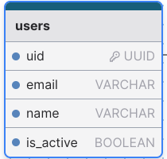

## Boas práticas e padronizações

### Sumário

<ol>
  <li><a href="#nomenclaturas">Nomenclaturas</a>
    <ol>
      <li><a href="#bases-de-dados">Bases de dados</a></li>
      <li><a href="#tabelas">Tabelas</a></li>
      <li><a href="#colunas">Colunas</a></li>
      <li><a href="#chaves-e-constantes">Chaves primárias, chaves estrangeiras e constantes</a></li>
    </ol>
  </li>
  <li><a href="#auditoria">Auditoria básica</a></li>
  <li><a href="#exclusao-logica">Exclusão lógica</a></li>
</ol>

<h3 id="nomenclaturas">Nomenclaturas</h3>
<h4 id="bases-de-dados">Bases de dados</h4>

<p>Ao criar uma nova base de dados, o nome deve refletir a qual produto/cliente essa base de dados se refere e a qual ambiente a mesma está inserida. Por exemplo:</p>

- Ambiente desenvolvimento: nomeDoProjeto-api-dev || nomeDoProjeto-site-dev
- Ambiente Homologação: nomeDoProjeto-api-homolog || nomeDoProjeto-site-homolog
- Ambiente Produção: nomeDoProjeto-api || nomeDoProjeto-site

<p>Utilizar a nomenclatura que indica o ambiente pode evitar alguns problemas ao
realizarmos operações diretamente no banco de dados.</p>

<h4 id="tabelas">Tabelas</h4>

- Nome da tabela em inglês
- Sempre no plural
- Todas as letras em minúsculo
- Utilizar o underscore (_) como separador das palavras.

> EXAMPLE: **Exemplos**
>
> * Tabela de usuários: <strong>users</strong>
> * Tabela de tipos de perfil do usuário: <strong>roles</strong>
> * Tabela pivô entre usuários e perfil de usuários: <strong>user_roles</strong>


<h4 id="colunas">Colunas</h4>

- Nome da coluna em inglês
- Sempre no singular
- Todas as letras em minúsculo
- Utilizar o underscore (_) como separador das palavras.
- Para campos booleanos, utilizar prefixos como has_, is_ 
- Utilizar uid (tipo UUID) como nome de chaves primárias.

EXAMPLE: **Exemplo**
    

<h4>Tipos de colunas</h4>

- Coluna para identificador único de registro (UUID ou GUID)

<p>A coluna de identificador único de um registro (normalmente chave primária da tabela) deve ter preferência por valores aleatórios como UUID's como forma de segurança da informação [OWASP - API SECURITY](https://owasp.org/API-Security/editions/2023/en/0xa1-broken-object-level-authorization/)</p>

- Coluna para senha do usuário

<p>A coluna responsável por armazenar a senha do usuário deve ser sempre salva criptografada, a criptografia da senha é realizada a nível de código antes de salvar a informação no banco de dados.</p>

- Normalização/sanitização dos dados:

<p>Os dados devem ser salvos em um formato cru e padronizado. Por exemplo: um CPF 123.456.789-01 deve ser salvo como 12345678901. O mesmo é válido para outros tipo de dados que possuam máscara como CNPJ, RG, Telefone, Celular, etc.</p>

<p>A razão pra isso reside na normalização do dado, flexibilidade de formatação e consistência dos dados. Esse tratamento para deixar o dado cru ocorre a nível de código, ou seja, antes de salvar o registro no banco.</p>

QUESTION: **Quando usar tipo inteiro ao invés de numeric, double ou real?**
    <p> Em colunas onde é sabido que você vai guardar um valor inteiro é melhor usar
    um tipo INTEGER ou BIGINT. Pois seu armazenamento ocupará menos espaço e será mais performático do
    que um campo do tipo NUMERIC, DECIMAL, DOUBLE ou real. Usar esses tipos de colunas quando
    realmente for necessário, tal como valores monetários ou números com frações.</p>

<p>Sempre que o objetivo for <em>armazenar um valor monetário ou valor com parte fracionária em que for
importante persistir com precisão o valor até certo número de casas decimais</em>, deve-se priorizar o uso do
campo <strong>numeric, com a definição da precisão esperada.</strong></p>

Exemplo:

```
CREATE TABLE product (
name VARCHAR(100) NOT NULL,
price NUMERIC(5,2) // 5 dígitos com precisão de 2 casas à direita do ponto decimal. Ex: 123.45
);

```
    

<h2 id="auditoria">Auditoria básica</h2>

<p>Todas as tabelas devem ter as colunas <strong>created_at e updated_at</strong> por padrão.</p>

- Criado em (Data e hora da criação do registro)
    - created_at: TIMESTAMPTZ NOT NULL DEFAULT CURRENT_TIMESTAMP()
- Atualizado em (Data e hora da atualização do registro)
    - updated_at: TIMESTAMPTZ NOT NULL DEFAULT CURRENT_TIMESTAMP()

<p><strong>Se necessário e conforme projeto,</strong> nas entidades onde serão salvos dados de certa importância, recomenda-se a inclusão de alguns campos
para compor uma auditoria básica.</p>

- Criado por (Usuário que criou o registro)
    - created_by: Identificador do usuário - UUID NOT NULL
- Atualizado por (Usuário que atualizou o registro)
    - updated_by: Identificador do usuário - UUID NOT NULL

 <p>Em caso de exclusão lógica.</p>

- Deletado por (Usuário que deletou o registro)
    - deleted_by: Identificador do usuário - UUID NOT NULL
- Deletado em  (Data e hora da exclusão do registro)
    - deleted_at TIMESTAMPTZ NOT NULL DEFAULT CURRENT_TIMESTAMP()

<h2 id="exclusa-logica">Exclusão lógica</h2>

<p>Este conceito é para ser utilizado quando queremos "excluir" um registro, de forma que ele deixe de
aparecer em nosso sistema, mas que continue existindo no banco de dados. Utilizar o seguinte padrão:</p>

- is_deleted BOOLEAN DEFAULT false

O Sistema Gerenciador de Banco de Dados (SGBD) utilizado e recomendado pela empresa é o [DBeaver](https://dbeaver.io/). Essa ferramenta está melhor detalhada na sessão de [Ferramentas&Tecnologias](/tech-tools/)
