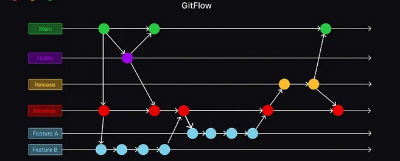

## Boas práticas e padronizações

### Sumário

<ol>
  <li><a href="#commits">Commits</a></li>
  <li><a href="#gitflow">Gitflow</a></li>
</ol>

<h2 id="commits">Commits</h2>

Recomenda-se o uso de mensagens de commit padronizadas e semânticas que reflitam a alteração que o commit irá realizar.
As mensagens devem ser preferencialmente em inglês, a menos que haja recomendação contrária por parte do cliente ou líder do projeto.

<h3>Mensagens de commit semânticos</h3>

prefixo: mensagem do commit

EXAMPLE: **Exemplo**
`feat: create new endpoint to get all users`

<h5>Tipos de prefixos:</h5>

- `feat`: (Nova feature)
- `fix`: (Correção/Fix de bugs)
- `docs`: (Criação/alteração de documentação)
- `style`: (Formatação, identação, estilo de código e arquivos de estilização .scss, .css, styles.ts, etc)
- `refactor`: (Refatoração de código, Exemplo: renomear variáveis, alterar um fluxo/bloco de código, etc)
- `test`: (Criação/alteração de arquivos de testes)
- `chore`: (Criação/alteração arquivos de configuração do projeto. Ex: novo script no package.json, criação de um dockerFile, docker-compose, etc)

<h4>Referências e mais detalhes sobre padrões de commit semânticos:</h4>

- [Conventional Commits](https://www.conventionalcommits.org/)
- [Semantic Commits Messages](https://seesparkbox.com/foundry/semantic_commit_messages)

<h2 id="gitflow">Gitflow</h2>

Gitflow é um fluxo de trabalho que determina alguns padrões para gerenciamento e fusão de branchs em projetos que utilizam Git como versionador de código. É especialmente útil em projetos onde atuam diversos desenvolvedores em paralelo, minimizando conflitos de código e facilitando o merge.

1. Branches principais:
    - Branch `main/master`: É a branch principal que representa o estado do código no ambiente de produção.
    - Branch `develop`: É a branch onde o código em desenvolvimento para a próxima versão reside. As novas funcionalidades do sistema são incluídas aqui antes de serem finalizadas e mescladas na branch de `main/master`
2. Tipos de branches:
    - <strong>Feature branches:</strong> Criados a partir da branch de `develop` para  desenvolver novas funcionalidades. Uma vez concluídas as funcionalidades a branch é mesclada de volta para `develop`.
    - <strong>Release branches:</strong> Criados a partir do `develop` quando todos os recursos planejados para a próxima versão estão prontos, normalmente ao final de uma sprint. Toda release recebe uma tag de versionamento no seguinte padrão: <strong>vX.X.X</strong>
    - <strong>Release branches:</strong> Criados a partir do `main/master` para corrigir rapidamente problemas críticos encontrados em produção. Uma vez corrigidos, são mesclados tanto no `main/master` quanto no `develop`. Esse fluxo evita que o bug corrigido em produção persista na branch de `develop`, mantendo as duas branches atualizadas.

<h3>Fluxo de trabalho com o GitFlow</h3>

- Desenvolvedores criam `feature branches` a partir da branch de `develop`.
- Uma vez finalizadas as funcionalidades, as `feature branches` são mescladas de volta em `develop`.
- Quando tudo estiver pronto para uma nova release, é criada uma `release branch` a partir de `develop`.
- Após a validação e homologação da release na `release branch`, ela é mesclada para `main/master` e entra em produção.
- Correções de bugs são tratadas em `hotfix branches` criadas a partir do `main/master` e mescladas de volta tanto no `main/master` quanto no `develop`.

Existe uma extensão para o VSCode que auxilia no uso do GitFlow. Essa extensão está melhor detalhada na sessão de [Ferramentas&Tecnologias](/tech-tools/)
