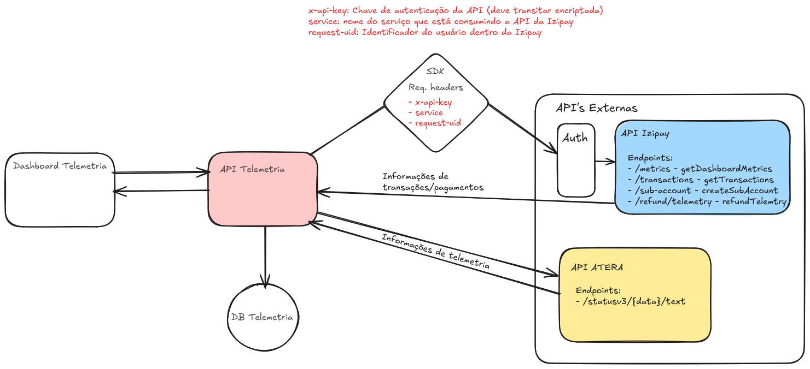
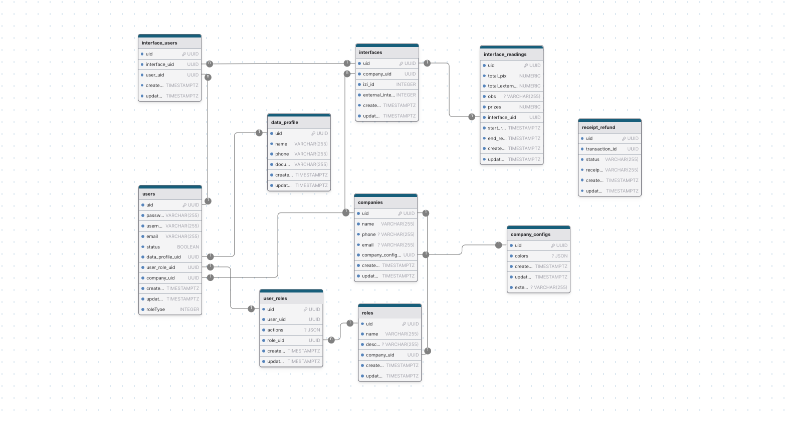
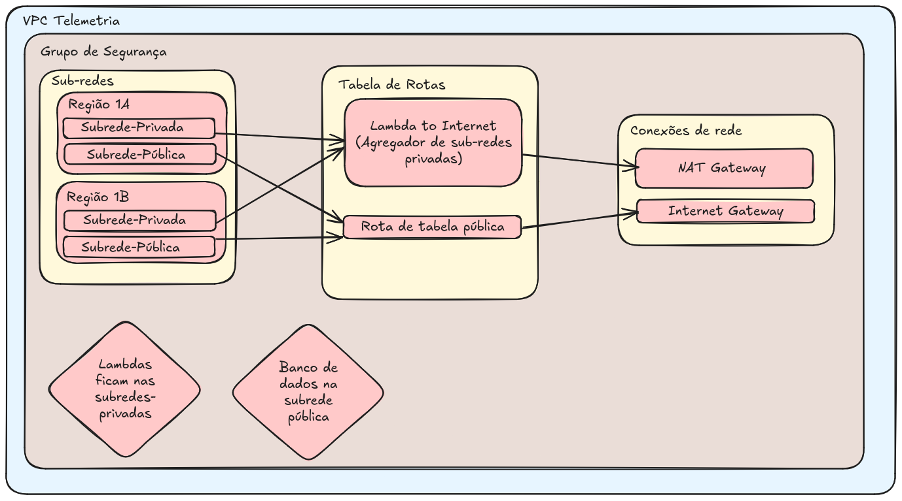

# Sistema de Telemetria

WARNING: **Status da aplicação**
**Em produção**

---

#### Contexto

A aplicação de telemetria é um sistema white-label que é utilizado pela Bankizi para atender clientes que desejam utilizar os serviços bancários da bankizi como meios de pagamentos para seus negócios.
Atualmente, a aplicação roda com um cliente que utiliza o serviço de PIX da Bankizi em máquinas de ursinhos de pelúcia, permitindo aos usuários pagar a jogada na máquina através de um PIX estático que é colado na máquina.

---

#### Aplicações

O sistema é composto de duas aplicações: um dashboard no front-end responsável por apresentar as informações de telemetria e transações aos administradores e operadores e um back-end responsável por se comunicar com outras duas API's externas e servir o dashboard com as informações necessárias.
As aplicações estão divididas em repositórios separados e independentes.

---


#### Dashboard Front-end

##### Tecnologias utilizadas

- Framework FUSE React
- React
- TailwindCss
- MaterialUI (MUI)
- Typescript

#### Back-end

##### Tecnologias utilizadas

- Serverless Framework
- AWS Lambdas
- Typescript
- NodeJS
- JWT
- PostgreSQL
- KnexJS

---

#### Fluxo de comunicação entre as API's



---

#### Banco de dados

- É um banco de dados PostgreSQL.


##### Modelagem do banco de dados



---

#### Infraestrutura na AWS



##### Ambientes de homologação

- [Link da aplicação do dashboard em homologação](https://develop.d1wl150ymgj6k8.amplifyapp.com/sign-in)

- [Link da API em homologação](https://0gd5tte0ia.execute-api.us-east-1.amazonaws.com/homolog)

---

#### SDK


#### Estrutura/Organização do projeto da API

O código-fonte do projeto se encontra principalmente dentro do diretório `src`. Esse diretório é dividido em:

- `functions` - contém o código-fonte e as configurações das lambdas
- `libs` - contém código/funções compartilhadas entre as lambdas
- `utils` - contém algumas funções auxiliares

```
.
├── src
│   ├── @types                  # Knex global types module
│   ├── config
│   │     └── db                # Knex configuration file
│   ├── functions               # Lambda configuration and source code folder
│   │   └── users
│   │       ├── handler.ts      # `Users` lambda source code
│   │       ├── index.ts        # `Users` lambda Serverless configuration
│   │       ├── routes.ts       # `Users` routes definitions
│   │       ├── user.controller # `Users` controller responsible by receive requests 
│   │       └── user.service.ts # `Users` service is where the business logic and DB comunication is wrapped
│   │
│   ├── libs                     # Lambda shared code
│   │    └── apiGateway.ts       # API Gateway specific helpers
│   │    └── handlerResolver.ts  # Sharable library for resolving lambda handlers
│   │    └── lambda.ts           # Lambda middleware
│   │
│   │
│   ├── middlewares             # Middlewares like auth middleware
│   └── utils                   # Some utils resources, functions, extension methods, etc
├── package.json
├── serverless.ts               # Serverless service file
├── tsconfig.json               # Typescript compiler configuration
└── tsconfig.paths.json         # Typescript paths
```

---

#### Autenticação/Segurança

- A aplicação utiliza JWT token para realizar a autenticação e autorização de acesso ao sistema. Após realizar o login no sistema a API retorna um `access_token`. Esse token é enviado através do request headers (Authorization) em todas as requisições para a API.

- Existe um middleware de autenticação na API que valida este token em toda requisição que tenta acessar um endpoint privado.

#### Lambdas

##### userLambda

- Responsável pelo CRUD de usuários do sistema (Gestão de usuários)
- É uma rota privada/autenticada através de JWT.
- Apenas usuários do tipo Admin possuem permissão para realizar ações de gestão de usuários.

Ao criar um novo usuário ele pode ter dois perfis:

- roleType = 2 (admin)
- roleType = 3 (operador)

INFO: **OBS**
Neste fluxo de criação existe uma integração com a API da Izipay para que o usuário criado no sistema da telemetria também seja criado no sistema da Izipay (apenas usuários cadastrados na API da izipay possuem permissão para transacionar valores)

##### authLambda

- Responsável por realizar o fluxo de login/signin e manter o usuário logado através do JWT token.
- Login/signin pode ser realizado através de email/username e senha.

##### metricLambda

- Responsável por buscar as informações necessárias de transações e interfaces para retornar para tela de Dashboard (gráficos) do front-end.
- É uma rota privada/autenticada através de JWT.
- Aceita filtro por uma data única e pela semana anterior (Últimos 7 dias)

INFO: **OBS**
Neste fluxo existe integração com a API da Izipay para buscar todos os dados relativos a transações, valores de transações, etc. E também consulta a API da Atera para trazer as informações de quantidade de interfaces online/offline no dia.

##### transactionLambda

- Responsável por fornecer as informações que populam a tela de listagem transações/vendas no dashboard e por realizar o estorno/reembolso de uma transação.
- Todas as rotas desta lambda são privadas/autenticadas através de JWT.
- A rota de getAll aceita filtros por **ID da transação**, **Nome da loja/ponto**, **nome do cliente**, **status** e **período de tempo**.

WARNING: **Estorno**
Só é possível recuperar comprovante de estorno/reembolso de transações que foram estornadas através do sistema da telemetria. (É possível realizar o estorno diretamente através do dashboard da Iugu, nesses casos, não temos como salvar o comprovante de estorno emitido e por sua vez a transação estornada por lá ficará sem o comprovante associado no nosso sistema/banco de dados)

INFO: **OBS**
Neste fluxo existe integração com a API da Izipay para buscar todos os dados relativos a transações, valores de transações, etc.


##### interfaceLambda

- Responsável por fornecer as informações de telemetria que populam a tela de listagem de telemetria no dashboard, detalhe de uma telemetria, associar um operador a uma interface e gerar relatórios de uma interface.
- Todas as rotas desta lambda são privadas/autenticadas através de JWT.

WARNING: **Divisão das interfaces por cliente**
A API da Atera, no momento que este documento foi escrito, não possui um controle de a quais clientes pertecem cada interface, de forma que essa responsabilidade recai sobre a nossa API. Temos uma lista de todas as interfaces do principal cliente (KGK games) e removemos da lista da Atera qualquer interface que não esteja inclusa nesta lista do cliente, com o objetivo de mostrar apenas as interfaces pertencentes ao cliente Kgk.

INFO: **OBS**
Neste fluxo existe integração com a API da Izipay para buscar o total transacionado via Pix e a quantidade de transações do dia. Todas as demais informações são obtidas através de integração com a API da Atera.

---
